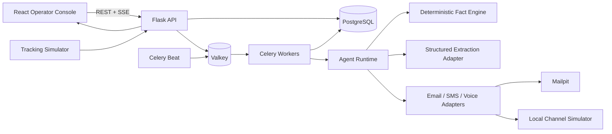
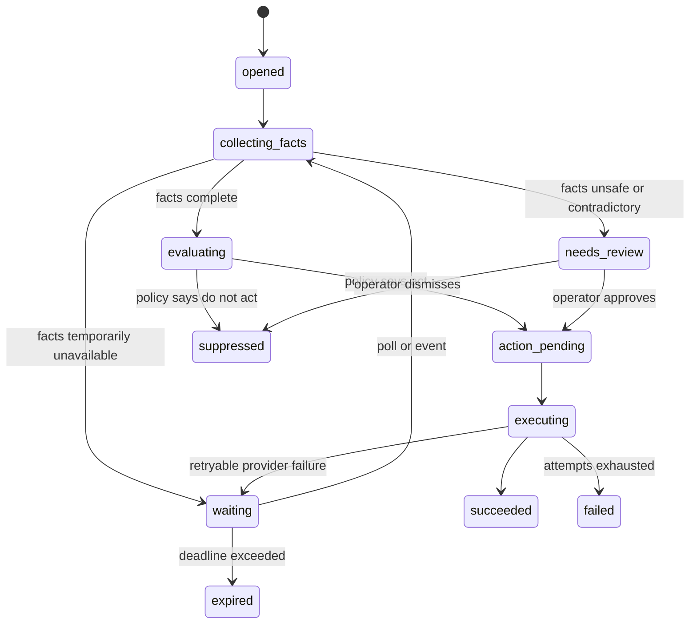

# RelayOps: Autonomous Freight Agent Operations Platform

**Product requirements document**  
**Version:** 1.0  
**Date:** 2026-08-30  
**Repository:** `freight-exception-agent`  
**Audience:** Hiring client, engineering reviewers, freight operations leaders, and implementers  
**Status:** Proposed for implementation

## 1. Executive summary

RelayOps is a local-first, production-shaped demonstration of an autonomous-agent platform for live truckload freight operations. It is designed to prove that its author can own the exact surface described in the target role: Python services, Celery workers, PostgreSQL correctness, narrow and controlled LLM usage, multitenant safety, email/SMS/voice workflows, operational observability, and an admin experience that lets a brokerage trust and configure the system.

The product is not a generic chatbot and not a dispatch-optimization clone. Its central object is an **agent goal**: a durable, tenant-scoped piece of work opened because a shipment needs attention or a customer asked a question. Goals advance through explicit state machines, compute facts from authoritative data, record every reason they act or decline to act, and perform idempotent communication steps through channel adapters.

The demo will ship with five agent types:

1. Late Pickup Alert
2. Reactive Status Email
3. Proof-of-Delivery Collection
4. ETA Confirmation
5. Detention Risk

All five share a deliberately small runtime while retaining type-specific scanners, state graphs, policies, templates, facts, and operator views. The default environment uses synthetic freight data, Mailpit email, and local SMS/voice simulators. Optional SendGrid, Twilio, Vapi, OpenAI, and OSRM adapters can be enabled without changing domain behavior.

## 2. Why this product exists

### 2.1 Hiring objective

Within five minutes, the target client should be able to see direct evidence for the role's highest-risk requirements:

- Background-job and at-least-once delivery fundamentals
- Database-enforced idempotency under retries and racing workers
- Strong Python and pragmatic SQL
- Production-safe LLM boundaries
- Freight domain fluency
- Multitenant authorization and inbound-email safety
- Observability that counts every outcome, including why an agent did not act
- End-to-end ownership from trigger through UI, tests, deployment, and documentation

### 2.2 Product objective

Give freight operations teams one place to answer four questions:

1. What needs attention now?
2. What are the agents doing about it?
3. Why did an agent act, wait, suppress, or fail?
4. What measurable value did the agent fleet create?

### 2.3 Portfolio objective

Demonstrate how the author's experience in dispatch optimization, quality assurance, analytics engineering, forecasting, and conversational data systems translates into trustworthy autonomous operations software.

## 3. Product principles

1. **Facts are computed; prose is generated.** Location, ETA, lateness, dwell, tenant identity, authorization, and state transitions are deterministic.
2. **The database is the concurrency boundary.** Correctness does not depend on a worker remembering what it already did.
3. **Unknown is a valid answer.** The system must never invent a location, ETA, POD, or delivery claim.
4. **Every non-action is observable.** Disabled tenant, stale tracking, unverified sender, below threshold, already notified, and missing load are distinct outcomes.
5. **One small runtime, explicit extension seams.** Agent types plug into stable contracts; they do not create separate frameworks.
6. **Tenant and authorization decisions never come from an LLM.** Model output cannot choose a tenant, recipient, or permission.
7. **Safe demo by default.** No external message is sent unless an operator explicitly configures and enables a live provider.
8. **Operations density over decorative dashboards.** The interface prioritizes triage, evidence, and action history.
9. **No framework theater.** Flask, Celery, PostgreSQL, direct interfaces, and narrow helpers are preferred over agent orchestration frameworks.
10. **Fast local proof, credible production path.** One command runs the full demo, while service boundaries map cleanly to ECS/Fargate.

## 4. Scope

### 4.1 In scope

- A Flask JSON API and server-sent-events stream
- Celery workers and Celery Beat scanners
- PostgreSQL primary data store with handwritten SQL migrations
- Redis/Valkey broker and result backend
- React and TypeScript operator console
- Five autonomous freight agent types
- Agent goals, state transitions, facts, actions, outcomes, and audit trails
- Two synthetic brokerage tenants with distinct configurations
- Synthetic live loads, stops, legs, GPS updates, appointment windows, and POD state
- Mailpit-based outbound and inbound email demonstration
- Local SMS and voice provider simulators with transcripts and delivery events
- Optional OpenAI plus Instructor structured extraction
- Deterministic extraction fallback for credential-free demos
- Optional SendGrid, Twilio, Vapi, and OSRM adapters
- MapLibre map with OpenFreeMap tiles and an offline visual fallback
- Per-tenant agent configuration, templates, thresholds, and channel policies
- Queue, worker, provider, and agent-level observability
- Scenario simulator for happy paths and failure cases
- Unit, integration, concurrency, API-contract, and browser tests
- Docker Compose local environment
- Production deployment reference for AWS ECS, ECR, ALB, GitHub Actions, and Terraform/Terragrunt
- Interview walkthrough and architecture documentation

### 4.2 Out of scope

- A complete transportation management system
- Route optimization or dispatcher assignment optimization
- Real ELD hardware ingestion
- Carrier billing, settlement, invoicing, or load tendering
- A general-purpose conversational assistant
- User-authentication federation with a production identity provider
- Production AWS resources created automatically from the demo
- Autonomous changes to source-of-truth freight data
- Sending real communications in the default configuration

### 4.3 Scope decomposition

The complete product is divided into six independently demonstrable increments:

1. Platform foundation and operations shell
2. Late Pickup Alert vertical slice
3. Reactive Status Email vertical slice
4. POD, ETA Confirmation, and Detention Risk agents
5. Tenant configuration, communications, analytics, and simulator
6. Resilience, UI polish, deployment reference, and interview narrative

Each increment must start, run, and pass its own acceptance tests before the next begins.

## 5. Personas and permissions

### 5.1 Platform operator

Usually the CTO or engineer covering the agent system. Can inspect all demo tenants, worker health, failures, traces, configurations, provider deliveries, and audit records. Can retry failed goals and pause an agent globally.

### 5.2 Brokerage administrator

Configures agent enrollment for one tenant, thresholds, recipients, schedules, templates, and channel preferences. Cannot access other tenants or global infrastructure controls.

### 5.3 Account manager

Receives shipment alerts, views loads for their tenant, previews communication history, and resolves needs-review goals. Cannot alter global agent definitions.

### 5.4 Read-only reviewer

Can use the complete product tour and inspect seeded traces without mutating configuration. This is the default interview persona.

### 5.5 External sender or driver

Interacts only through email, SMS, or voice. External identities are never treated as application users and are always evaluated by channel-specific safety gates.

## 6. Core domain vocabulary

- **Tenant:** A freight brokerage or enrolled customer boundary.
- **Load:** A shipment with one or more stops and legs.
- **Stop:** A pickup or delivery location with appointment windows and arrival/departure facts.
- **Tracking point:** A timestamped location and source-quality record for a truck.
- **Agent definition:** Versioned behavior shared by all tenants for one agent type.
- **Tenant agent configuration:** Tenant-specific enablement, thresholds, recipients, schedules, templates, and provider selection.
- **Trigger:** A scanner finding or inbound event that may open a goal.
- **Goal:** Durable, idempotent work for one tenant, agent type, subject, and trigger episode.
- **Goal event:** Append-only state-transition or evidence record.
- **Fact snapshot:** Immutable inputs used to make one decision.
- **Action:** A requested side effect such as email, SMS, or voice outreach.
- **Action attempt:** One provider attempt for an action.
- **Outcome:** A countable terminal or intermediate reason describing what happened.
- **Conversation:** A tenant-scoped email/SMS/voice thread associated with a load when known.
- **Memory:** Validated conversation facts and customer preferences; never an unbounded prompt transcript.

## 7. System architecture

### 7.1 Runtime topology



### 7.2 Services

| Service | Responsibility | Local container |
|---|---|---|
| `web` | Flask API, inbound webhooks, SSE, readiness | Yes |
| `worker` | Goal dispatch, state transitions, actions, retries | Yes |
| `beat` | Proactive scanner schedules and maintenance jobs | Yes |
| `postgres` | Source of truth and concurrency constraints | Yes |
| `valkey` | Celery broker, ephemeral locks, short-lived stream coordination | Yes |
| `frontend` | React operator console | Yes |
| `mailpit` | Safe email inbox and SMTP sink | Yes |
| `simulator` | GPS ticks and scripted channel/provider responses | Integrated with `web` for the first release |

### 7.3 Backend module boundaries

- `agent_core`: contracts, dispatcher, state-machine executor, outcomes, and idempotent action creation
- `agents/<type>`: scanner or trigger adapter, state graph, policy, facts required, templates, and transitions
- `domain`: tenant, load, stop, tracking, conversation, and goal entities
- `facts`: deterministic ETA, lateness, dwell, tracking freshness, POD, and status computations
- `channels`: email, SMS, and voice interfaces plus local and live adapters
- `inbound`: webhook normalization, safety gate ladder, and reply orchestration
- `llm`: structured extraction interface, OpenAI/Instructor adapter, fixture adapter, and prompt registry
- `repositories`: SQLAlchemy mappings plus explicit raw SQL for scanner and concurrency-sensitive operations
- `observability`: structured logs, metrics, health, traces, and outcome aggregation
- `api`: versioned HTTP resources, serialization, authorization, and SSE
- `simulator`: seeded scenarios, virtual clock controls, and deterministic replay

### 7.4 Frontend module boundaries

- `app-shell`: navigation, tenant switcher, global search, system status
- `fleet-overview`: agent cards, outcome summaries, queue health, value metrics
- `live-operations`: priority load list, selected-load map, milestones, and agent activity
- `goals`: filters, virtualized table, state and outcome views
- `goal-trace`: evidence, transitions, LLM extraction, safety gates, and actions
- `inbox`: reactive requests, blocked/accepted gates, reply preview, thread history
- `catalog`: agent capabilities and global versions
- `configuration`: tenant enrollment, thresholds, schedules, recipients, templates, and providers
- `communications`: email/SMS/voice attempts, provider status, transcripts, and previews
- `analytics`: value, reliability, latency, suppression, and trend reports
- `system-health`: workers, queues, beat schedules, providers, database, and incidents
- `simulator`: scenario launcher, virtual time, injected failures, and replay controls

## 8. Shared agent runtime

### 8.1 Agent extension contract

Every agent type implements the following conceptual interface:

```python
class AgentType(Protocol):
    key: str
    version: str
    trigger_kind: Literal["scanner", "inbound"]

    def eligibility(self, context: TriggerContext) -> EligibilityDecision: ...
    def initial_state(self) -> str: ...
    def required_facts(self, state: str) -> tuple[str, ...]: ...
    def decide(self, goal: Goal, facts: FactSnapshot) -> TransitionDecision: ...
    def render_action(self, goal: Goal, facts: FactSnapshot) -> ActionRequest: ...
```

The runtime owns persistence, transitions, retries, idempotency, action attempts, outcome recording, and audit metadata. Agent types own only domain-specific policy.

### 8.2 Goal lifecycle



Every transition writes one append-only `goal_event` in the same database transaction as the goal's new state.

### 8.3 Idempotency

Goal creation uses a database unique constraint on:

`(tenant_id, agent_type, subject_type, subject_id, trigger_fingerprint)`

Action creation uses a database unique constraint on:

`(tenant_id, goal_id, action_kind, recipient_fingerprint, action_fingerprint)`

Workers use `INSERT ... ON CONFLICT DO NOTHING RETURNING id` or equivalent transactional SQL. A duplicate scanner result, Celery redelivery, manual retry, or racing worker must resolve to the existing row and must not produce a second provider send.

### 8.4 At-least-once behavior

- Celery tasks acknowledge only after the database transition commits.
- Tasks are safe to replay from any state.
- A claimed goal includes a lease timestamp and worker identity.
- Expired leases are recoverable by a maintenance task.
- Provider calls use a stable action idempotency key where supported.
- Provider uncertainty produces `delivery_unknown`, not an assumed success.
- Retry schedules use capped exponential backoff with jitter.
- Non-retryable failures record a distinct outcome and move to `needs_review` or `failed` according to policy.

### 8.5 Outcome taxonomy

The minimum shared outcomes are:

- `acted_successfully`
- `action_delivery_unknown`
- `provider_retry_scheduled`
- `provider_attempts_exhausted`
- `tenant_disabled`
- `agent_disabled`
- `outside_schedule`
- `below_threshold`
- `already_open_goal`
- `already_notified`
- `facts_incomplete`
- `facts_contradictory`
- `tracking_stale`
- `load_not_found`
- `sender_unverified`
- `sender_not_enrolled`
- `tenant_ambiguous`
- `rate_limited`
- `loop_suppressed`
- `intent_unsupported`
- `reference_ambiguous`
- `expired_without_action`
- `operator_suppressed`

Outcomes are machine-countable, tenant-scoped, agent-versioned, and visible in the UI.

## 9. Deterministic freight fact engine

The fact engine is the only component allowed to calculate operational facts used in outbound communication.

### 9.1 Inputs

- Load and stop state
- Appointment window and timezone
- Latest valid tracking point and its age
- Route distance and expected travel duration
- Arrival/departure geofence events
- POD document state
- Tenant thresholds and business hours
- Prior outreach and replies

### 9.2 Outputs

- Current location label and coordinates
- Tracking freshness classification
- Current leg and next stop
- Distance and duration remaining
- Predicted arrival timestamp
- Early/on-time/at-risk/late/unknown classification
- Minutes early or late
- Dwell minutes and detention-risk classification
- POD required/received/missing classification
- Confidence and evidence timestamps

### 9.3 Honesty rules

- ETA is unavailable when tracking is older than the tenant's maximum age unless another authoritative event supplies position.
- A driver's stated ETA is labeled as driver-confirmed and never silently treated as computed ETA.
- Contradictory sources trigger `needs_review` when configured confidence rules cannot select one safely.
- Outbound templates omit unsupported facts rather than filling placeholders with guesses.
- Every fact shown in a message links to its evidence in the goal trace.

## 10. Agent specifications

### 10.1 Late Pickup Alert

**Trigger:** Celery Beat scanner evaluates active loads on a configurable interval.  
**Subject:** Pickup stop.  
**Primary recipient:** Account manager or tenant-configured operations group.

Eligibility requires:

- Agent enabled for the tenant
- Load active and not canceled
- Pickup not completed
- Appointment exists
- Computed ETA available and tracking sufficiently fresh
- Predicted arrival later than the configured threshold
- No equivalent open goal or successful alert for the trigger episode
- Current time inside configured outreach schedule, unless severity overrides the schedule

Default progression:

`opened -> collecting_facts -> evaluating -> action_pending -> executing -> succeeded`

Operator-visible evidence includes appointment, predicted ETA, lateness, latest GPS, traffic assumption, configuration threshold, prior communication, idempotency key, and provider delivery.

### 10.2 Reactive Status Email

**Trigger:** Inbound email webhook.  
**Subject:** Normalized inbound message.  
**Primary recipient:** Verified sender.

Safety gate ladder, in order:

1. Normalize provider payload and preserve message identifiers.
2. Suppress auto-reply loops, bounces, and known provider probes.
3. Check per-address and per-tenant rate limits.
4. Verify envelope sender and required provider signature.
5. Evaluate SPF result; expose DKIM/DMARC results when provided.
6. Resolve enrolled sender to exactly one tenant.
7. Strip unsafe HTML and quote history for extraction while preserving the original for audit.
8. Invoke the narrow structured extractor for reference number and supported intent.
9. Resolve the reference inside the already-authorized tenant only.
10. Compute shipment facts deterministically.
11. Render a template with honest degradation.
12. Create one idempotent reply action and preserve threading headers.

Supported intents:

- Current status
- Current location
- On-time or ETA question
- Next milestone
- POD availability
- General status, which returns the safe combined summary

Replies to the generated answer append to the same conversation and update validated memory such as preferred reference format. Free-form model summaries are not written directly into authorization or load records.

### 10.3 Proof-of-Delivery Collection

**Trigger:** Delivery completed while required POD is absent beyond a tenant threshold.  
**Subject:** Delivery stop.  
**Recipients:** Driver by SMS first, email second, optional voice escalation.

Progression:

1. Validate delivered state and missing document.
2. Send a secure local-demo upload request.
3. Wait for upload or driver response.
4. Retry according to tenant cadence.
5. Escalate to account manager after the final driver attempt.
6. Close immediately when a POD event arrives.

The demo upload stores metadata and a sample document identifier rather than accepting arbitrary public files.

### 10.4 ETA Confirmation

**Trigger:** Computed ETA unavailable, stale, contradictory, or within a configured uncertainty band near an appointment.  
**Subject:** Active leg.  
**Primary recipient:** Driver by SMS; optional voice fallback.

The request asks for a concise ETA or current situation. The system parses responses into a structured candidate, validates timestamps and plausibility, records driver-confirmed evidence separately, recomputes the customer-facing status, and optionally notifies the account manager.

The LLM may normalize phrases such as “about 45 out” into a candidate duration. Deterministic code applies that duration to the message receive time and rejects impossible values.

### 10.5 Detention Risk

**Trigger:** Truck has arrived at a stop but has not departed before a configurable dwell threshold.  
**Subject:** Stop visit.  
**Recipients:** Account manager and optionally driver.

Eligibility considers geofence arrival, manual check-in, stop type, free-time policy, departed state, tracking freshness, and prior detention outreach. The agent records current dwell, estimated free-time remaining, evidence quality, and next escalation timestamp.

The agent never asserts that detention charges are owed. It states observable dwell facts and asks for confirmation or action.

## 11. LLM contract and safety

### 11.1 Allowed uses

- Extract a load/reference identifier and supported intent from inbound email
- Normalize a driver's ETA phrase into a structured candidate
- Classify a reply into a small, versioned response schema
- Produce an optional internal-only concise explanation from already validated facts

### 11.2 Prohibited uses

- Selecting a tenant
- Authorizing a sender or recipient
- Looking up a load without tenant scoping
- Calculating location, ETA, lateness, dwell, or POD state
- Choosing whether a communication is legally or operationally permitted
- Creating arbitrary workflow steps
- Writing directly to authoritative freight records

### 11.3 Structured extraction schema

```json
{
  "reference_number": "LD-1048",
  "intent": "eta",
  "confidence": 0.97,
  "needs_clarification": false
}
```

The schema rejects unknown keys and unsupported intent values. The adapter receives only sanitized, length-limited text. Prompt version, model name, latency, token counts, schema-validation failures, and final structured output are recorded. Raw secrets and provider credentials are never logged.

### 11.4 Credential-free behavior

The fixture extractor recognizes the seeded scenarios deterministically. The UI labels it `Local structured extractor`; it does not pretend an external model ran. When `OPENAI_API_KEY` is configured, the OpenAI/Instructor adapter can be selected per environment without changing agent policy.

## 12. Communication channels

### 12.1 Email

- SMTP delivery to Mailpit by default
- Optional SendGrid outbound adapter
- Local inbound webhook form and `.eml` fixture replay
- Optional SendGrid Inbound Parse adapter
- MIME text and HTML alternatives
- Outlook-safe table-based transactional templates
- `Message-ID`, `In-Reply-To`, and `References` threading support
- Provider signature, envelope sender, SPF, DKIM, and DMARC result display
- Bounce, complaint, dropped, delivered, and opened event normalization when available

### 12.2 SMS

- Local conversation simulator by default
- Optional Twilio adapter
- E.164 normalization
- STOP/START opt-out enforcement
- Message-length preview and segment count
- Delivery receipt normalization
- Inbound reply correlation to action and conversation

### 12.3 Voice

- Local call simulator with state changes and seeded transcript
- Optional Vapi adapter
- Configurable escalation only after SMS failure or timeout
- Disclosure text stored with the template version
- Call initiated, answered, completed, no-answer, and failed states
- Transcript and extracted structured response separated visibly

### 12.4 Safe-send switch

The global environment mode is one of:

- `sandbox`: all messages route to local providers
- `allowlist`: external providers may send only to configured test recipients
- `live`: external delivery allowed for enabled tenants

The default is `sandbox`. UI badges and confirmation text make the current mode unmistakable.

## 13. Multitenancy and authorization

- Every tenant-owned table includes `tenant_id`.
- Repository methods require an explicit tenant scope.
- Cross-tenant platform views are separate operator-only endpoints.
- Inbound sender resolution occurs before any load lookup.
- The LLM receives no candidate tenant list.
- A reference collision across tenants cannot leak existence or status.
- Configuration changes write actor, old value, new value, reason, and timestamp.
- Demo authentication uses signed local sessions with seeded roles.
- Production guidance documents OIDC integration without implementing a vendor-specific provider.
- Tests attempt cross-tenant access for every tenant-owned API resource.

## 14. Data model

### 14.1 Primary tables

| Table | Purpose | Important constraints or indexes |
|---|---|---|
| `tenants` | Brokerage boundary | Unique slug |
| `users` | Demo users and roles | Unique email; tenant nullable only for platform operator |
| `tenant_memberships` | User-to-tenant role | Unique tenant/user |
| `agent_definitions` | Agent type and version metadata | Unique type/version |
| `tenant_agent_configs` | Enrollment and policy | Unique tenant/agent type; JSON schema version |
| `loads` | Shipment header | Unique tenant/reference; status index |
| `stops` | Pickup/delivery appointments | Load/sequence unique; appointment index |
| `legs` | Movement between stops | Load/sequence unique |
| `tracking_points` | Location evidence | Tenant/load/recorded-at index; source event unique |
| `documents` | POD metadata | Tenant/load/type/status index |
| `inbound_messages` | Normalized inbound events | Provider/message-id unique |
| `conversations` | Thread identity and memory | Tenant/channel/thread-key unique |
| `conversation_messages` | Immutable channel messages | Provider/message-id unique where present |
| `goals` | Durable agent work | Goal idempotency unique key; state and lease indexes |
| `goal_events` | Append-only transitions/evidence | Goal/sequence unique |
| `fact_snapshots` | Immutable decision inputs | Goal/version unique; content hash |
| `actions` | Intended side effects | Action idempotency unique key |
| `action_attempts` | Provider attempts | Action/attempt unique; provider id unique where present |
| `outcomes` | Countable results | Tenant/agent/reason/time index |
| `audit_events` | Security and configuration history | Tenant/actor/time index |
| `prompt_versions` | LLM prompt and schema metadata | Use-case/version unique |
| `simulation_runs` | Scenario replay metadata | Scenario/start-time index |

### 14.2 Migration policy

- Migrations are numbered, handwritten SQL files.
- Each migration contains an explicit transactional `up` section and a documented rollback strategy.
- A `schema_migrations` table records applied checksum and timestamp.
- Startup refuses to serve traffic when required migrations are missing.
- No Alembic dependency is used.

### 14.3 Raw SQL demonstrations

The project intentionally uses readable raw SQL for:

- Scanner candidate selection from a large active-load board
- Atomic goal insertion under concurrency
- Goal claiming with `FOR UPDATE SKIP LOCKED`
- Outcome and value aggregation
- Tracking-point latest-row queries

Each query includes a representative `EXPLAIN (ANALYZE, BUFFERS)` fixture and index rationale in the engineering notes.

## 15. API and event contract

All application endpoints are under `/api/v1` and return an envelope containing `data`, `meta`, and structured `error` when applicable.

### 15.1 Core endpoints

| Method and path | Purpose |
|---|---|
| `GET /dashboard` | Fleet overview and value summary |
| `GET /loads` | Filtered load board |
| `GET /loads/{id}` | Load, stops, tracking, and related goals |
| `GET /loads/{id}/route` | Route geometry and latest position |
| `GET /goals` | Filterable goals queue |
| `GET /goals/{id}` | Goal detail and current state |
| `GET /goals/{id}/trace` | Events, facts, decisions, actions, and outcomes |
| `POST /goals/{id}/retry` | Retry an eligible failed goal |
| `POST /goals/{id}/resolve` | Approve or suppress a needs-review goal |
| `GET /inbox` | Reactive inbound messages |
| `GET /inbox/{id}` | Gate ladder, extraction, reply, and thread |
| `POST /inbound/email` | Local/SendGrid normalized inbound webhook |
| `POST /inbound/sms` | Local/Twilio normalized inbound webhook |
| `POST /inbound/voice` | Local/Vapi normalized event webhook |
| `GET /agents` | Agent catalog and health |
| `GET /agents/{type}` | Version, capabilities, and metrics |
| `GET /tenants/{id}/agent-configs` | Tenant enrollment and policies |
| `PUT /tenants/{id}/agent-configs/{type}` | Validated configuration update |
| `POST /tenants/{id}/agent-configs/{type}/dry-run` | Evaluate config against sample data |
| `GET /communications` | Message and call history |
| `GET /analytics/outcomes` | Outcome counts and trends |
| `GET /analytics/value` | Time saved, SLA, and coverage metrics |
| `GET /system/health` | Component health summary |
| `GET /system/queues` | Celery queue and worker status |
| `POST /simulations` | Start a seeded scenario |
| `POST /simulations/{id}/advance` | Advance virtual time |
| `POST /simulations/{id}/inject` | Inject a documented failure/event |
| `GET /events` | Tenant-scoped SSE updates |

### 15.2 Error format

```json
{
  "data": null,
  "meta": {"request_id": "req_01J..."},
  "error": {
    "code": "GOAL_NOT_RETRYABLE",
    "message": "This goal is already complete.",
    "details": {"state": "succeeded"}
  }
}
```

Error messages exposed to tenant users do not reveal cross-tenant identifiers or internal exception text.

### 15.3 Live updates

Server-sent events notify the UI about:

- Load position and status changes
- Goal opened, transitioned, or completed
- New communication and delivery updates
- Queue or provider health changes
- Simulation clock and injected events

Events contain resource identifiers and versions; the UI refetches canonical resource data instead of treating the stream as a source of truth.

## 16. Operator console information architecture

### 16.1 Global shell

- Compact left navigation with Overview, Live Operations, Goals, Inbox, Agents, Communications, Analytics, System, and Simulator
- Tenant switcher with explicit `All tenants` operator state
- Global search for load reference, BOL, driver, customer, goal, email, and phone
- Environment badge showing Sandbox, Allowlist, or Live
- Worker/provider health indicator
- Virtual-time indicator when a simulation is active
- Keyboard shortcut palette

### 16.2 Fleet Overview

The home screen answers whether the agent fleet is healthy and valuable.

- Active agents by tenant and version
- Goals opened, completed, waiting, needs review, and failed
- Queue depth and oldest pending age
- Actions sent by channel and delivery rate
- Explicit non-action reasons
- Estimated operator minutes saved
- Median and p95 time from trigger to action
- Accuracy/unknown indicators for computed ETA availability
- Top tenants, agents, and exceptions requiring attention
- Recent activity stream with direct trace links

### 16.3 Live Operations

This preserves the strongest control-tower elements without making the map the product.

- Priority load list ordered by operational risk
- Status segments: needs action, late, no signal, detention, on track, complete
- Selected-load context with milestones, appointment windows, tracking freshness, and route
- Map occupying approximately one third of the workspace
- Active and historical agent goals on the selected load
- Latest communications and next scheduled action
- Direct links to the complete goal trace and tenant policy

### 16.4 Goals Queue

- Dense, virtualized table with agent, tenant, load, state, age, next tick, outcome, recipient, and worker
- Saved filters for Needs review, Waiting too long, Provider failures, Duplicate suppressed, and Completed today
- Bulk selection only for safe operations such as export; retries remain deliberate per-goal actions
- Expandable transition preview
- CSV export of the current filtered view

### 16.5 Goal Trace

This is the signature interview screen.

- Summary header with goal, tenant, subject, state, outcome, and duration
- Vertical chronological state graph
- Trigger evidence and eligibility checklist
- Immutable fact snapshot with source timestamps
- Policy evaluation with the relevant configuration values
- LLM step showing sanitized input, prompt/schema version, structured output, latency, and validation
- Safety gate ladder for inbound workflows
- Idempotency panel showing key, unique constraint, conflict result, and action reuse
- Action attempts with provider request, response class, retry schedule, and delivery events
- Message preview or voice transcript
- Structured logs filtered to the goal correlation id
- Operator actions with explicit consequences

### 16.6 Reactive Inbox

- Accepted, blocked, needs clarification, replied, and failed tabs
- Original sender, envelope sender, auth results, tenant match, subject, and receive age
- Safety gate ladder with passed/failed reason
- Structured reference/intent extraction
- Tenant-scoped load match
- Computed answer facts and confidence
- HTML and plain-text reply preview
- Thread history and validated memory
- Replay in simulator and copy-as-cURL actions

### 16.7 Agent Catalog

- Cards for five agent types with trigger, channel, active tenants, version, success rate, and latest deployment
- Agent detail with state graph, configuration schema, templates, outcome taxonomy, recent regressions, and changelog
- Global pause/resume available only to platform operator
- Version comparison and tenant adoption status

### 16.8 Tenant Configuration

- Enrollment toggle and rollout mode
- Scanner interval or inbound address
- Thresholds with units and validation
- Business schedule and timezone
- Recipient rules and escalation order
- Channel selection and fallback sequence
- Template editor with required fact placeholders
- Safe preview against a seeded load
- Dry-run results showing how recent sample loads would have been classified
- Versioned publish flow with audit reason
- Reset to inherited defaults

### 16.9 Communications

- Unified email, SMS, and voice timeline
- Provider state, recipient, tenant, load, goal, template version, and attempt count
- Search and filters by delivery outcome
- Rendered email preview, SMS segment preview, and voice transcript
- Retry status and idempotency evidence
- Sandbox inbox deep link

### 16.10 Analytics and Value

- Outcomes by agent, tenant, and day
- Acted versus suppressed versus unable-to-act funnel
- Trigger-to-action latency distribution
- Contact delivery and response rate by channel
- Estimated manual touches avoided
- Late pickup alerts before appointment
- POD collection cycle time
- ETA-confirmation response rate
- Detention-risk lead time
- Unknown-data rate and tracking-staleness rate
- Agent-version comparison
- Downloadable CSV with filters and methodology drawer

### 16.11 System Health

- API, database, Valkey, Beat, worker, Mailpit, SMS simulator, voice simulator, and LLM adapter status
- Queue depth, active tasks, scheduled tasks, retries, and dead-letter-equivalent failures
- Latest successful scanner per tenant and agent
- Worker heartbeat and lease recovery events
- Provider latency and error rate
- Database connection pool and read-replica simulation status
- Recent incidents generated by simulator scenarios

### 16.12 Scenario Simulator

The simulator makes difficult production properties visible on demand.

Scenario library:

1. Late pickup, successful email
2. Two racing scanners, exactly one goal and email
3. Worker crash after provider call, safe redelivery
4. Stale GPS, honest unknown response
5. Valid reactive status email
6. SPF failure blocked before load lookup
7. Same load reference in two tenants without data leak
8. Customer auto-reply loop suppressed
9. POD collected after SMS reminder
10. ETA confirmation via SMS reply
11. Detention threshold crossed and escalated
12. SendGrid/Twilio/Vapi simulated outage and recovery
13. Tenant disabled mid-goal
14. Configuration dry run before publish

Each scenario resets only its isolated dataset, displays expected invariants, advances virtual time, and links to every generated goal, outcome, and communication.

## 17. Visual design requirements

### 17.1 Direction

The visual language is a mature freight operations product: compact, calm, legible, and evidence-heavy. It should feel credible beside modern transportation visibility platforms without copying any one product.

### 17.2 Layout

- Desktop-first responsive layout optimized for 1366 px and wider
- Persistent 64 px icon navigation rail with expandable labels
- 48-56 px global header
- Dense 36-44 px operational table rows
- Resizable split panes for list/context/trace workflows
- Map secondary to operational content
- Drawers only for quick inspection; deep traces receive full pages

### 17.3 Color and semantics

- Neutral graphite navigation
- Off-white workspace with white evidence surfaces
- Teal for selected/healthy/complete
- Amber for waiting/at-risk
- Red for failed/late/blocked safety events
- Blue for informational or in-progress states
- Purple reserved for the narrow LLM extraction step
- Status never communicated by color alone

### 17.4 Typography and density

- Inter or a system sans stack
- Tabular numerals for times, durations, counts, and identifiers
- Monospace only for SQL, event ids, idempotency keys, schemas, and payloads
- 13-14 px operational body text with accessible contrast
- Clear hierarchy without oversized marketing headings

### 17.5 Interaction quality

- Every destructive or external action previews its effect
- Loading skeletons preserve layout
- Empty states explain why data is absent and how to create a demo scenario
- Filters serialize into the URL
- Keyboard navigation covers tables, tabs, drawers, and dialogs
- Visible focus states and ARIA labels
- Reduced-motion preference respected
- Error states preserve entered configuration and show field-level correction

## 18. Observability

### 18.1 Structured logs

Every log record includes when applicable:

- `timestamp`
- `level`
- `service`
- `request_id`
- `task_id`
- `tenant_id`
- `agent_type`
- `agent_version`
- `goal_id`
- `load_id`
- `action_id`
- `outcome_reason`
- `duration_ms`

Secrets, message bodies, and raw phone/email values are redacted from normal logs.

### 18.2 Metrics

- Scanner duration and candidates
- Goals opened, transitioned, completed, expired, and failed
- Goals and actions deduplicated
- State residence duration
- Fact availability and freshness
- LLM extraction success, schema failure, retry, latency, and token use
- Channel attempts, deliveries, responses, bounces, and unknowns
- Queue depth, task runtime, retry count, and oldest age
- Per-agent outcome reasons
- API request rate, latency, and error rate
- Database query latency for named critical queries

### 18.3 Health semantics

- `healthy`: component meets its freshness and error thresholds
- `degraded`: work continues but a dependency or data source is impaired
- `unhealthy`: safe operation cannot continue
- `unknown`: the component has not reported enough evidence

The UI distinguishes a paused agent from an unhealthy runtime.

## 19. Reliability and error handling

- API and tasks use stable error codes.
- Database timeouts are retryable only for operations proven idempotent.
- Provider 4xx validation errors do not retry blindly.
- Provider 429 and transient 5xx responses use backoff and `Retry-After` when available.
- Malformed inbound payloads are quarantined with redacted audit metadata.
- Failed structured extraction may retry once, then requests clarification or enters needs review.
- Missing facts move proactive goals to waiting until the deadline, then expire with an explicit reason.
- A circuit breaker can pause one external provider without pausing deterministic fact processing.
- Readiness fails when migrations are missing or the primary database is unavailable.
- Liveness does not fail merely because an optional provider is degraded.
- Worker shutdown drains the current task within a bounded grace period.

## 20. Performance requirements

Measured on the documented local Docker environment:

- Initial operator-console content visible within 2.5 seconds on a warm local run
- p95 read API latency below 300 ms for seeded data
- p95 configuration write below 500 ms
- Scan 10,000 active synthetic loads in under 5 seconds using the indexed candidate query
- Open and dispatch a goal within 10 seconds of scanner eligibility under normal local load
- Reactive email accepted and reply action created within 5 seconds, excluding external provider latency
- Goals table supports 50,000 rows through server pagination and virtualized rendering
- SSE reconnects with exponential backoff and refreshes canonical state after connection loss

Performance claims shown in the UI must come from repeatable benchmark fixtures, not hard-coded marketing numbers.

## 21. Security and privacy requirements

- No secrets committed to the repository
- `.env.example` documents every variable without real values
- Provider webhook signatures verified by live adapters
- Constant-time comparison used for shared webhook secrets
- HTML email sanitized before display
- Content Security Policy applied to the frontend
- SQL parameters bound; no string-formatted user input
- Rate limits enforced before expensive LLM or database work where possible
- PII masked in list views and normal logs
- Full message content visible only to authorized tenant users and platform operators
- Audit records are append-only through application interfaces
- Downloaded CSV is tenant-scoped and records an audit event
- Demo reset cannot run when environment mode is `live`

## 22. Testing strategy

### 22.1 Test layers

1. **Pure unit tests:** state transitions, policies, facts, schemas, template guards, and safety gates
2. **Repository integration tests:** PostgreSQL constraints, raw SQL, tenant filters, migrations, and query plans
3. **Celery integration tests:** retries, redelivery, leases, task routing, and scheduled scans
4. **Concurrency tests:** racing scanners and racing workers prove one goal/action
5. **Provider contract tests:** local adapters and recorded sanitized response fixtures
6. **API tests:** roles, tenant boundaries, validation, pagination, and error envelopes
7. **Frontend component tests:** filters, traces, configuration validation, and status semantics
8. **Browser end-to-end tests:** seeded scenarios and critical operator journeys
9. **Resilience tests:** dependency outage, stale tracking, worker interruption, and unknown delivery
10. **Performance tests:** scanner query, dashboard aggregation, and goals pagination

### 22.2 Critical invariants

- A duplicate task never creates a duplicate goal or action.
- A sender cannot retrieve a load outside the resolved tenant.
- An LLM output cannot set tenant, recipient, authorization, or computed freight facts.
- A reply never claims an unknown fact.
- Every terminal goal has at least one countable outcome.
- Every outbound communication links to one goal and one immutable fact snapshot.
- Every configuration change is auditable.
- Pausing one tenant does not pause another.
- A provider outage cannot corrupt goal state.

### 22.3 TDD requirement

Behavior is implemented through red-green-refactor cycles. Every new domain behavior begins with a failing test observed for the intended reason. Configuration scaffolding and generated lockfiles are the only implementation artifacts exempt from test-first behavior.

## 23. Local development and demo environment

### 23.1 One-command start

```bash
docker compose up --build
```

After health checks pass:

- Operator console: `http://localhost:5173`
- Flask API: `http://localhost:8000/api/v1`
- Mailpit: `http://localhost:8025`
- API documentation: `http://localhost:8000/docs`

### 23.2 Seeded identities

- Platform operator with all-tenant view
- Atlas Brokerage administrator
- Meridian Freight account manager
- Read-only reviewer

Credentials are conspicuously demo-only and documented in the README.

### 23.3 Seeded freight data

- Two tenants
- At least 50 active and historical loads
- Multiple stops, legs, timezones, and appointment patterns
- Fresh, stale, missing, and contradictory tracking data
- Delivered loads with present and missing PODs
- Completed agent traces for every terminal outcome category used in the UI
- Live simulation ticks that update a small subset of loads

## 24. Production deployment reference

The repository includes non-applying reference infrastructure:

- Multi-stage Dockerfiles running as non-root
- ECS task definitions for API, worker, and Beat
- Separate autoscaling guidance for web and worker services
- ALB routing and health checks
- ECR image lifecycle policy
- RDS PostgreSQL primary plus read-replica connection configuration
- ElastiCache-compatible Valkey configuration
- Secrets Manager references
- CloudWatch log groups, metrics, and alarms
- GitHub Actions workflow for lint, test, build, migration check, and image publish
- Terraform/Terragrunt directory structure with documented variables
- Deployment and rollback runbook

The local demo does not provision AWS resources or require an AWS account.

## 25. Demo narrative

### 25.1 Five-minute client walkthrough

1. Open Fleet Overview and point out agent health, outcomes, queue freshness, and measurable value.
2. Launch `Two racing scanners` in Simulator.
3. Open the resulting Late Pickup goal trace and show two trigger attempts resolving to one goal.
4. Show the immutable facts, policy decision, database idempotency key, and single Mailpit email.
5. Open Reactive Inbox and replay a valid status request.
6. Show sender gates, narrow LLM extraction, tenant-scoped lookup, computed ETA, and threaded reply.
7. Switch to an SPF-failure request and show that it is blocked before load lookup.
8. Change the detention threshold in a dry run and show affected loads without publishing.
9. Finish on Analytics with acted and did-not-act outcomes.

### 25.2 Fifteen-minute technical walkthrough

Add:

- Raw scanner SQL and index rationale
- Celery acknowledgement and lease behavior
- State-machine extension interface
- Provider adapter boundaries
- Cross-tenant tests
- Honest unknown/stale-tracking scenario
- ECS deployment mapping and operational runbook

## 26. Success metrics

### 26.1 Product proof metrics

- Five agent types visible and demonstrable
- Two trigger shapes demonstrated: proactive scanner and reactive inbound
- Three channel types demonstrated: email, SMS, and voice
- At least 20 distinct countable outcomes represented in seeded data or scenarios
- Duplicate scanner and task-redelivery scenarios create exactly one action
- Cross-tenant request suite contains zero data leaks
- Every displayed outbound fact links to evidence
- Full local stack starts from a clean checkout using documented commands

### 26.2 Interview success signals

The client can accurately infer that the author:

- Understands freight operations vocabulary and workflows
- Knows where LLMs belong and where they do not
- Can design for at-least-once delivery and retries
- Treats SQL and database constraints as system-design tools
- Can build polished operator software without hiding backend mechanics
- Thinks quantitatively about outcomes and customer value
- Documents tradeoffs and production risks honestly

## 27. Acceptance criteria

The product is accepted when all of the following are true:

1. `docker compose up --build` starts every required local service with passing health checks.
2. A clean database applies handwritten migrations and deterministic seed data automatically.
3. The operator can complete the five-minute walkthrough without command-line intervention.
4. All five agent types have catalog, configuration, goal, trace, outcome, and scenario representation.
5. Late Pickup and Reactive Status Email execute end to end through real Celery tasks and PostgreSQL persistence.
6. POD, ETA Confirmation, and Detention Risk execute end to end in sandbox channels.
7. Racing workers and task redelivery are proven not to duplicate actions.
8. Reactive email safety gates block unverified, unenrolled, rate-limited, looping, or tenant-ambiguous requests before unsafe lookup or reply.
9. Unknown or stale facts produce honest degraded responses.
10. Tenant users cannot read or mutate another tenant's resources.
11. Configuration changes can be previewed, dry-run, published, and audited.
12. Email, SMS, and voice attempts are visible with provider-normalized states.
13. Agent-level acted and did-not-act outcomes appear in Analytics.
14. System Health displays worker, queue, Beat, database, provider, and scanner freshness.
15. The UI meets keyboard, focus, contrast, and semantic-status requirements for the critical paths.
16. Unit, integration, concurrency, API, and browser suites pass from documented commands.
17. The repository contains architecture, setup, testing, operations, tradeoff, deployment, and interview-walkthrough documentation.
18. No real provider credential or customer data is required or committed.

## 28. Risks and mitigations

| Risk | Impact | Mitigation |
|---|---|---|
| Breadth reduces depth | Superficial implementation | Build in vertical increments; Late Pickup and Reactive Email receive the deepest correctness treatment first |
| External provider setup distracts from demo | Unreliable walkthrough | Sandbox adapters are first-class and deterministic; live providers are optional |
| UI becomes another generic dashboard | Weak role alignment | Goal trace, safety gates, idempotency, outcomes, and configuration are primary navigation surfaces |
| LLM appears central to decisions | Client distrust | Narrow schemas, deterministic facts, visible validation, and explicit prohibited-use rules |
| Synthetic data appears unrealistic | Weak domain credibility | Seed stops, legs, appointments, timezones, tracking freshness, dwell, POD, and communications consistently |
| Celery tests are flaky | Low confidence | Use deterministic task boundaries, PostgreSQL integration tests, and bounded virtual time |
| Public map tiles unavailable | Broken demo | Map component provides an offline route fallback and never blocks operational content |
| Local resource use is excessive | Poor developer experience | Small datasets by default, health checks, profiles for optional services, and documented minimum resources |

## 29. Delivery sequence

### Increment 1: Foundation

- Repository, Docker Compose, migrations, seed system, roles, React shell, health page, and CI baseline

### Increment 2: Late Pickup vertical slice

- Loads, stops, tracking, facts, scanner SQL, goal runtime, Celery dispatch, email sandbox, trace UI, concurrency proof

### Increment 3: Reactive Email vertical slice

- Inbound normalization, safety gates, structured extraction, tenant-scoped lookup, reply threading, inbox UI, memory

### Increment 4: Remaining agents and channels

- POD Collection, ETA Confirmation, Detention Risk, SMS simulator, voice simulator, and optional live-adapter interfaces

### Increment 5: Control plane and value

- Agent catalog, tenant configuration, template preview, dry run, communications, analytics, and scenario simulator

### Increment 6: Production credibility and polish

- Resilience scenarios, query plans, performance fixtures, accessibility, responsive refinement, AWS reference, runbooks, and interview walkthrough

## 30. Explicit technical decisions

1. Python 3.13, Flask, Celery, PostgreSQL, Valkey, SQLAlchemy, psycopg, Pydantic, OpenAI, and Instructor align to the target environment.
2. Handwritten SQL migrations are used; Alembic is intentionally absent.
3. React, TypeScript, Vite, TanStack Query, MapLibre, and Recharts power the operator console.
4. Server-sent events are used instead of WebSockets because updates are server-to-client and reconnection semantics are simpler.
5. Mailpit, local SMS, and local voice adapters are production-quality test doubles, not UI-only mocks.
6. PostgreSQL is required for correctness tests; SQLite is not used as an integration substitute.
7. OpenAI is optional in local development; adapter behavior remains explicit in the UI.
8. Core agent orchestration uses direct Python interfaces and state tables rather than LangChain or a general agent framework.
9. The map is supporting context, not the primary product surface.
10. Real external delivery requires an explicit safe-send mode change and provider configuration.

## 31. Documentation deliverables

- `README.md`: product story, quick start, screenshots, and interview path
- `docs/architecture.md`: services, boundaries, data flow, and diagrams
- `docs/agent-runtime.md`: contracts, states, retries, and idempotency
- `docs/email-safety.md`: inbound ladder, threading, SPF/DKIM/DMARC, and threat cases
- `docs/sql-and-indexes.md`: critical queries and query-plan evidence
- `docs/operations.md`: health, triage, pause, retry, recovery, and incident checklist
- `docs/configuration.md`: schemas, rollout, dry runs, and audit behavior
- `docs/testing.md`: test layers, commands, fixtures, and concurrency scenarios
- `docs/deployment.md`: Docker and AWS/ECS reference
- `docs/tradeoffs.md`: deliberate simplifications and deferred production work
- `docs/interview-walkthrough.md`: five- and fifteen-minute scripts

## 32. Definition of impressive

RelayOps is impressive only if it makes reliability visible. Visual polish supports that goal, but the decisive moments are:

- Watching two racing scanner tasks produce one database goal
- Watching a retried action reuse its idempotency identity instead of sending twice
- Seeing an unsafe inbound email fail before any tenant data lookup
- Seeing an LLM extract two narrow fields while deterministic code produces every freight fact
- Seeing an agent say “ETA unavailable because GPS is stale” instead of fabricating confidence
- Changing a tenant policy, dry-running it, publishing it without a deploy, and seeing the audit record
- Explaining Monday-morning performance with counted outcomes rather than anecdotes

Those moments directly demonstrate the engineering judgment the target client is hiring for.
